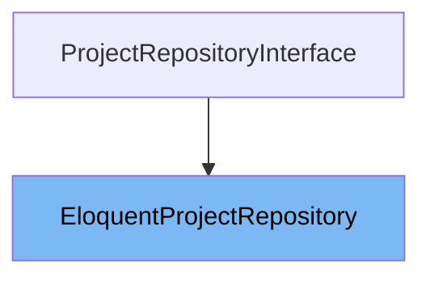

# Inheritance diagram

This diagram shows the inheritance tree of the class:



This document explains the <SwmToken path="app/Domain/Projects/Repositories/EloquentProjectRepository.php" pos="9:2:2" line-data="class EloquentProjectRepository implements ProjectRepositoryInterface">`EloquentProjectRepository`</SwmToken> class. We will cover:

1. What is <SwmToken path="app/Domain/Projects/Repositories/EloquentProjectRepository.php" pos="9:2:2" line-data="class EloquentProjectRepository implements ProjectRepositoryInterface">`EloquentProjectRepository`</SwmToken>
2. Variables and functions of <SwmToken path="app/Domain/Projects/Repositories/EloquentProjectRepository.php" pos="9:2:2" line-data="class EloquentProjectRepository implements ProjectRepositoryInterface">`EloquentProjectRepository`</SwmToken>

# What is <SwmToken path="app/Domain/Projects/Repositories/EloquentProjectRepository.php" pos="9:2:2" line-data="class EloquentProjectRepository implements ProjectRepositoryInterface">`EloquentProjectRepository`</SwmToken>

<SwmToken path="app/Domain/Projects/Repositories/EloquentProjectRepository.php" pos="9:2:2" line-data="class EloquentProjectRepository implements ProjectRepositoryInterface">`EloquentProjectRepository`</SwmToken> is a class that implements the <SwmToken path="app/Domain/Projects/Repositories/EloquentProjectRepository.php" pos="9:6:6" line-data="class EloquentProjectRepository implements ProjectRepositoryInterface">`ProjectRepositoryInterface`</SwmToken> and provides an Eloquent ORM-based implementation for managing Project entities. It acts as a data access layer to perform CRUD operations and query filtering on projects stored in the database.

<SwmSnippet path="/app/Domain/Projects/Repositories/EloquentProjectRepository.php" line="16">

---

The constructor <SwmToken path="app/Domain/Projects/Repositories/EloquentProjectRepository.php" pos="16:5:5" line-data="    public function __construct(Project $project)">`__construct`</SwmToken> initializes the repository with a Project model instance. This allows the repository to create new queries and perform operations on the Project model.

```hack
    public function __construct(Project $project)
    {
        $this->project = $project;
    }
```

---

</SwmSnippet>

<SwmSnippet path="/app/Domain/Projects/Repositories/EloquentProjectRepository.php" line="21">

---

The function <SwmToken path="app/Domain/Projects/Repositories/EloquentProjectRepository.php" pos="21:5:5" line-data="    public function paginate(array $filters = [], $perPage = 15): LengthAwarePaginator">`paginate`</SwmToken> returns a paginated list of projects. It accepts optional filters and a per-page count, applies the filters to the query, sanitizes the page size, and returns a <SwmToken path="app/Domain/Projects/Repositories/EloquentProjectRepository.php" pos="21:27:27" line-data="    public function paginate(array $filters = [], $perPage = 15): LengthAwarePaginator">`LengthAwarePaginator`</SwmToken> ordered by project name.

```hack
    public function paginate(array $filters = [], $perPage = 15): LengthAwarePaginator
    {
        $query = $this->project->newQuery()->orderBy('name');

        $this->applyFilters($query, $filters);

        $perPage = $this->sanitizePageSize($perPage);

        return $query->paginate($perPage);
    }
```

---

</SwmSnippet>

<SwmSnippet path="/app/Domain/Projects/Repositories/EloquentProjectRepository.php" line="32">

---

The function <SwmToken path="app/Domain/Projects/Repositories/EloquentProjectRepository.php" pos="32:5:5" line-data="    public function all(array $filters = []): Collection">`all`</SwmToken> returns a collection of all projects matching optional filters. It applies the filters to a query ordered by project name and returns the results as a Collection.

```hack
    public function all(array $filters = []): Collection
    {
        $query = $this->project->newQuery()->orderBy('name');

        $this->applyFilters($query, $filters);

        return $query->get();
    }
```

---

</SwmSnippet>

<SwmSnippet path="/app/Domain/Projects/Repositories/EloquentProjectRepository.php" line="41">

---

The function <SwmToken path="app/Domain/Projects/Repositories/EloquentProjectRepository.php" pos="41:5:5" line-data="    public function findBySlug(string $slug): ?Project">`findBySlug`</SwmToken> retrieves a single Project by its slug. It returns the first matching project or null if none is found.

```hack
    public function findBySlug(string $slug): ?Project
    {
        return $this->project->newQuery()->where('slug', $slug)->first();
    }
```

---

</SwmSnippet>

<SwmSnippet path="/app/Domain/Projects/Repositories/EloquentProjectRepository.php" line="46">

---

The function <SwmToken path="app/Domain/Projects/Repositories/EloquentProjectRepository.php" pos="46:5:5" line-data="    public function create(array $data): Project">`create`</SwmToken> creates a new Project record using the provided data array. It resolves the slug from the data, normalizes the catalog letter to uppercase if provided, and then creates the project.

```hack
    public function create(array $data): Project
    {
        $data['slug'] = $this->resolveSlug($data);
        $data['catalog_letter'] = isset($data['catalog_letter'])
            ? strtoupper($data['catalog_letter'])
            : null;

        return $this->project->create($data);
    }
```

---

</SwmSnippet>

<SwmSnippet path="/app/Domain/Projects/Repositories/EloquentProjectRepository.php" line="56">

---

The function <SwmToken path="app/Domain/Projects/Repositories/EloquentProjectRepository.php" pos="56:5:5" line-data="    public function update(Project $project, array $data): Project">`update`</SwmToken> updates an existing Project with new data. It resolves the slug if the name is changed and slug is not provided, normalizes the catalog letter, fills the project model with new data, saves it, and returns the updated project.

```hack
    public function update(Project $project, array $data): Project
    {
        if (!empty($data['name']) && empty($data['slug'])) {
            $data['slug'] = $this->resolveSlug($data);
        }

        if (isset($data['catalog_letter'])) {
            $data['catalog_letter'] = strtoupper($data['catalog_letter']);
        }

        $project->fill($data);
        $project->save();

        return $project;
    }
```

---

</SwmSnippet>

<SwmSnippet path="/app/Domain/Projects/Repositories/EloquentProjectRepository.php" line="72">

---

The function <SwmToken path="app/Domain/Projects/Repositories/EloquentProjectRepository.php" pos="72:5:5" line-data="    public function delete(Project $project): bool">`delete`</SwmToken> deletes a given Project instance from the database and returns a boolean indicating success.

```hack
    public function delete(Project $project): bool
    {
        return (bool) $project->delete();
    }
```

---

</SwmSnippet>

<SwmSnippet path="/app/Domain/Projects/Repositories/EloquentProjectRepository.php" line="77">

---

The private function <SwmToken path="app/Domain/Projects/Repositories/EloquentProjectRepository.php" pos="77:5:5" line-data="    private function applyFilters($query, array $filters): void">`applyFilters`</SwmToken> applies various filters to a query builder instance. It supports filtering by catalog letter, project type, featured status, and a search term that matches name, description, or project type.

```hack
    private function applyFilters($query, array $filters): void
    {
        if (!empty($filters['catalog_letter'])) {
            $query->where('catalog_letter', strtoupper($filters['catalog_letter']));
        }

        if (!empty($filters['project_type'])) {
            $query->where('project_type', $filters['project_type']);
        }

        if (array_key_exists('featured', $filters)) {
            $featured = $this->normalizeBoolean($filters['featured']);

            if ($featured !== null) {
                $query->where('is_featured', $featured);
            }
        }

        if (!empty($filters['search'])) {
            $search = $filters['search'];
            $query->where(function ($inner) use ($search) {
                $inner->where('name', 'like', "%{$search}%")
                    ->orWhere('description', 'like', "%{$search}%")
                    ->orWhere('project_type', 'like', "%{$search}%");
            });
        }
    }
```

---

</SwmSnippet>

<SwmSnippet path="/app/Domain/Projects/Repositories/EloquentProjectRepository.php" line="105">

---

The private function <SwmToken path="app/Domain/Projects/Repositories/EloquentProjectRepository.php" pos="105:5:5" line-data="    private function resolveSlug(array $data): string">`resolveSlug`</SwmToken> determines the slug for a project. It returns the slug from data if provided; otherwise, it generates a slug from the project name using the <SwmToken path="app/Domain/Projects/Repositories/EloquentProjectRepository.php" pos="111:3:3" line-data="        return str_slug($data[&#39;name&#39;]);">`str_slug`</SwmToken> helper.

```hack
    private function resolveSlug(array $data): string
    {
        if (!empty($data['slug'])) {
            return $data['slug'];
        }

        return str_slug($data['name']);
    }
```

---

</SwmSnippet>

<SwmSnippet path="/app/Domain/Projects/Repositories/EloquentProjectRepository.php" line="114">

---

The private function <SwmToken path="app/Domain/Projects/Repositories/EloquentProjectRepository.php" pos="114:5:5" line-data="    private function sanitizePageSize($perPage): int">`sanitizePageSize`</SwmToken> ensures the per-page pagination size is a positive integer and caps it at 100. If an invalid size is provided, it defaults to 15.

```hack
    private function sanitizePageSize($perPage): int
    {
        $perPage = (int) $perPage;

        if ($perPage <= 0) {
            $perPage = 15;
        }

        return min($perPage, 100);
    }
```

---

</SwmSnippet>

<SwmSnippet path="/app/Domain/Projects/Repositories/EloquentProjectRepository.php" line="125">

---

The private function <SwmToken path="app/Domain/Projects/Repositories/EloquentProjectRepository.php" pos="125:5:5" line-data="    private function normalizeBoolean($value)">`normalizeBoolean`</SwmToken> converts various input values into a boolean or null. It returns null for null or empty strings, otherwise uses PHP's <SwmToken path="app/Domain/Projects/Repositories/EloquentProjectRepository.php" pos="131:3:3" line-data="        return filter_var($value, FILTER_VALIDATE_BOOLEAN, FILTER_NULL_ON_FAILURE);">`filter_var`</SwmToken> to validate boolean values.

```hack
    private function normalizeBoolean($value)
    {
        if ($value === null || $value === '') {
            return null;
        }

        return filter_var($value, FILTER_VALIDATE_BOOLEAN, FILTER_NULL_ON_FAILURE);
    }
```

---

</SwmSnippet>

# Usage

## <SwmToken path="app/Domain/Projects/Repositories/EloquentProjectRepository.php" pos="9:2:2" line-data="class EloquentProjectRepository implements ProjectRepositoryInterface">`EloquentProjectRepository`</SwmToken>

<SwmToken path="app/Domain/Projects/Repositories/EloquentProjectRepository.php" pos="9:2:2" line-data="class EloquentProjectRepository implements ProjectRepositoryInterface">`EloquentProjectRepository`</SwmToken> is bound to the <SwmToken path="app/Domain/Projects/Repositories/EloquentProjectRepository.php" pos="9:6:6" line-data="class EloquentProjectRepository implements ProjectRepositoryInterface">`ProjectRepositoryInterface`</SwmToken> in the DomainServiceProvider. This binding means that whenever the <SwmToken path="app/Domain/Projects/Repositories/EloquentProjectRepository.php" pos="9:6:6" line-data="class EloquentProjectRepository implements ProjectRepositoryInterface">`ProjectRepositoryInterface`</SwmToken> is requested via dependency injection, an instance of <SwmToken path="app/Domain/Projects/Repositories/EloquentProjectRepository.php" pos="9:2:2" line-data="class EloquentProjectRepository implements ProjectRepositoryInterface">`EloquentProjectRepository`</SwmToken> will be provided. This setup allows the application to depend on the interface while using <SwmToken path="app/Domain/Projects/Repositories/EloquentProjectRepository.php" pos="9:2:2" line-data="class EloquentProjectRepository implements ProjectRepositoryInterface">`EloquentProjectRepository`</SwmToken> as the concrete implementation.

## Usage Example

In the DomainServiceProvider, the register method binds the interface to the <SwmToken path="app/Domain/Projects/Repositories/EloquentProjectRepository.php" pos="9:2:2" line-data="class EloquentProjectRepository implements ProjectRepositoryInterface">`EloquentProjectRepository`</SwmToken> class. This is done by calling the app container's bind method with <SwmToken path="app/Domain/Projects/Repositories/EloquentProjectRepository.php" pos="9:6:6" line-data="class EloquentProjectRepository implements ProjectRepositoryInterface">`ProjectRepositoryInterface`</SwmToken>::class as the abstraction and <SwmToken path="app/Domain/Projects/Repositories/EloquentProjectRepository.php" pos="9:2:2" line-data="class EloquentProjectRepository implements ProjectRepositoryInterface">`EloquentProjectRepository`</SwmToken>::class as the implementation. This pattern facilitates loose coupling and makes it easier to swap out the repository implementation if needed.

&nbsp;

*This is an auto-generated document by Swimm 🌊 and has not yet been verified by a human*

<SwmMeta version="3.0.0" repo-id="Z2l0aHViJTNBJTNBTGFyYXZlbC1PcGVuLVNvdXJjZS1Qcm9qZWN0cyUzQSUzQW11ZGFzaW4x" repo-name="Laravel-Open-Source-Projects"><sup>Powered by [Swimm](https://app.swimm.io/)</sup></SwmMeta>
