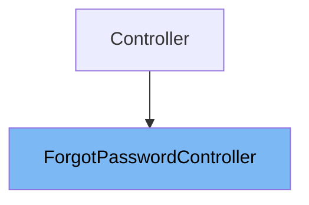

# Inheritance diagram

This diagram shows the inheritance tree of the class:



This document explains the <SwmToken path="app/Http/Controllers/Auth/ForgotPasswordController.php" pos="8:2:2" line-data="class ForgotPasswordController extends Controller">`ForgotPasswordController`</SwmToken> class. We will cover:

1. What is <SwmToken path="app/Http/Controllers/Auth/ForgotPasswordController.php" pos="8:2:2" line-data="class ForgotPasswordController extends Controller">`ForgotPasswordController`</SwmToken>
2. Variables and functions in <SwmToken path="app/Http/Controllers/Auth/ForgotPasswordController.php" pos="8:2:2" line-data="class ForgotPasswordController extends Controller">`ForgotPasswordController`</SwmToken>

# What is <SwmToken path="app/Http/Controllers/Auth/ForgotPasswordController.php" pos="8:2:2" line-data="class ForgotPasswordController extends Controller">`ForgotPasswordController`</SwmToken>

The <SwmToken path="app/Http/Controllers/Auth/ForgotPasswordController.php" pos="8:2:2" line-data="class ForgotPasswordController extends Controller">`ForgotPasswordController`</SwmToken> is a controller class located in <SwmPath>[app/…/Auth/ForgotPasswordController.php](app/Http/Controllers/Auth/ForgotPasswordController.php)</SwmPath>. It is responsible for handling password reset email requests in the application. This controller facilitates sending password reset links to users who have forgotten their passwords, enabling them to securely reset their credentials.

<SwmSnippet path="/app/Http/Controllers/Auth/ForgotPasswordController.php" line="28">

---

The constructor function <SwmToken path="app/Http/Controllers/Auth/ForgotPasswordController.php" pos="28:5:5" line-data="    public function __construct()">`__construct`</SwmToken> initializes the <SwmToken path="app/Http/Controllers/Auth/ForgotPasswordController.php" pos="8:2:2" line-data="class ForgotPasswordController extends Controller">`ForgotPasswordController`</SwmToken> instance. It applies the 'guest' middleware to ensure that only unauthenticated users can access the password reset functionality.

```hack
    public function __construct()
    {
        $this->middleware('guest');
    }
```

---

</SwmSnippet>

<SwmSnippet path="/app/Http/Controllers/Auth/ForgotPasswordController.php" line="21">

---

The class uses the <SwmToken path="app/Http/Controllers/Auth/ForgotPasswordController.php" pos="21:3:3" line-data="    use SendsPasswordResetEmails;">`SendsPasswordResetEmails`</SwmToken> trait, which provides the core functionality for sending password reset emails. This trait includes methods that handle the process of validating the email, generating the reset token, and sending the notification to the user.

```hack
    use SendsPasswordResetEmails;
```

---

</SwmSnippet>

&nbsp;

*This is an auto-generated document by Swimm 🌊 and has not yet been verified by a human*

<SwmMeta version="3.0.0" repo-id="Z2l0aHViJTNBJTNBTGFyYXZlbC1PcGVuLVNvdXJjZS1Qcm9qZWN0cyUzQSUzQW11ZGFzaW4x" repo-name="Laravel-Open-Source-Projects"><sup>Powered by [Swimm](https://app.swimm.io/)</sup></SwmMeta>
