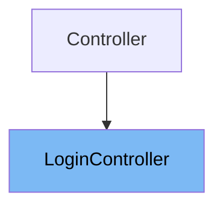

# Inheritance diagram

This diagram shows the inheritance tree of the class:



This document explains the <SwmToken path="app/Http/Controllers/Auth/LoginController.php" pos="8:2:2" line-data="class LoginController extends Controller">`LoginController`</SwmToken> class. We will cover:

1. What is <SwmToken path="app/Http/Controllers/Auth/LoginController.php" pos="8:2:2" line-data="class LoginController extends Controller">`LoginController`</SwmToken>
2. Variables and functions in <SwmToken path="app/Http/Controllers/Auth/LoginController.php" pos="8:2:2" line-data="class LoginController extends Controller">`LoginController`</SwmToken>

# What is <SwmToken path="app/Http/Controllers/Auth/LoginController.php" pos="8:2:2" line-data="class LoginController extends Controller">`LoginController`</SwmToken>

<SwmToken path="app/Http/Controllers/Auth/LoginController.php" pos="8:2:2" line-data="class LoginController extends Controller">`LoginController`</SwmToken> is a controller class located in <SwmPath>[app/…/Auth/LoginController.php](app/Http/Controllers/Auth/LoginController.php)</SwmPath>. It is responsible for handling user authentication in the application. Specifically, it manages the process of logging users in and redirecting them to the appropriate page after successful authentication. The controller leverages a trait to provide most of its functionality, simplifying the implementation.

<SwmSnippet path="/app/Http/Controllers/Auth/LoginController.php" line="35">

---

The constructor function <SwmToken path="app/Http/Controllers/Auth/LoginController.php" pos="35:5:5" line-data="    public function __construct()">`__construct`</SwmToken> initializes the <SwmToken path="app/Http/Controllers/Auth/LoginController.php" pos="8:2:2" line-data="class LoginController extends Controller">`LoginController`</SwmToken> instance. It applies middleware to restrict access so that only guests (unauthenticated users) can access the login functionality, except for the logout method which is accessible to authenticated users.

```hack
    public function __construct()
    {
        $this->middleware('guest')->except('logout');
    }
```

---

</SwmSnippet>

<SwmSnippet path="/app/Http/Controllers/Auth/LoginController.php" line="28">

---

The protected variable <SwmToken path="app/Http/Controllers/Auth/LoginController.php" pos="28:3:4" line-data="    protected $redirectTo = &#39;/home&#39;;">`$redirectTo`</SwmToken> defines the URL path where users are redirected after a successful login. In this case, it is set to '/home'.

```hack
    protected $redirectTo = '/home';
```

---

</SwmSnippet>

<SwmSnippet path="/app/Http/Controllers/Auth/LoginController.php" line="21">

---

The <SwmToken path="app/Http/Controllers/Auth/LoginController.php" pos="8:2:2" line-data="class LoginController extends Controller">`LoginController`</SwmToken> uses the <SwmToken path="app/Http/Controllers/Auth/LoginController.php" pos="21:3:3" line-data="    use AuthenticatesUsers;">`AuthenticatesUsers`</SwmToken> trait from the Laravel framework. This trait provides the core authentication logic such as showing the login form, validating user credentials, logging users in, and logging users out. By using this trait, the controller inherits these methods without needing to implement them explicitly.

```hack
    use AuthenticatesUsers;
```

---

</SwmSnippet>

&nbsp;

*This is an auto-generated document by Swimm 🌊 and has not yet been verified by a human*

<SwmMeta version="3.0.0" repo-id="Z2l0aHViJTNBJTNBTGFyYXZlbC1PcGVuLVNvdXJjZS1Qcm9qZWN0cyUzQSUzQW11ZGFzaW4x" repo-name="Laravel-Open-Source-Projects"><sup>Powered by [Swimm](https://app.swimm.io/)</sup></SwmMeta>
