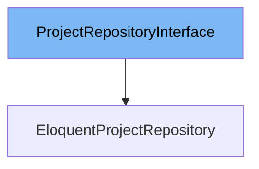

# Inheritance diagram

This diagram shows the inheritance tree of the interface:



This document explains the <SwmToken path="app/Domain/Projects/Repositories/ProjectRepositoryInterface.php" pos="9:2:2" line-data="interface ProjectRepositoryInterface">`ProjectRepositoryInterface`</SwmToken> in the codebase. We will cover:

1. What is <SwmToken path="app/Domain/Projects/Repositories/ProjectRepositoryInterface.php" pos="9:2:2" line-data="interface ProjectRepositoryInterface">`ProjectRepositoryInterface`</SwmToken>
2. Functions defined in <SwmToken path="app/Domain/Projects/Repositories/ProjectRepositoryInterface.php" pos="9:2:2" line-data="interface ProjectRepositoryInterface">`ProjectRepositoryInterface`</SwmToken>

# What is <SwmToken path="app/Domain/Projects/Repositories/ProjectRepositoryInterface.php" pos="9:2:2" line-data="interface ProjectRepositoryInterface">`ProjectRepositoryInterface`</SwmToken>

<SwmToken path="app/Domain/Projects/Repositories/ProjectRepositoryInterface.php" pos="9:2:2" line-data="interface ProjectRepositoryInterface">`ProjectRepositoryInterface`</SwmToken> is an interface located in <SwmPath>[app/…/Repositories/ProjectRepositoryInterface.php](app/Domain/Projects/Repositories/ProjectRepositoryInterface.php)</SwmPath>. It defines a contract for managing project data within the domain layer of the application. This interface abstracts the data access layer for projects, allowing different implementations to handle project retrieval, creation, updating, and deletion without affecting the rest of the application.

<SwmSnippet path="/app/Domain/Projects/Repositories/ProjectRepositoryInterface.php" line="11">

---

The function <SwmToken path="app/Domain/Projects/Repositories/ProjectRepositoryInterface.php" pos="18:5:5" line-data="    public function paginate(array $filters = [], $perPage = 15): LengthAwarePaginator;">`paginate`</SwmToken> lists projects with optional filtering and supports pagination. It accepts an array of filters and a per-page count, returning a <SwmToken path="app/Domain/Projects/Repositories/ProjectRepositoryInterface.php" pos="16:6:6" line-data="     * @return LengthAwarePaginator">`LengthAwarePaginator`</SwmToken> instance that contains the paginated projects.

```hack
    /**
     * List projects with optional filtering.
     *
     * @param array $filters
     * @param int $perPage
     * @return LengthAwarePaginator
     */
    public function paginate(array $filters = [], $perPage = 15): LengthAwarePaginator;
```

---

</SwmSnippet>

<SwmSnippet path="/app/Domain/Projects/Repositories/ProjectRepositoryInterface.php" line="20">

---

The function <SwmToken path="app/Domain/Projects/Repositories/ProjectRepositoryInterface.php" pos="21:5:5" line-data="     * Retrieve all projects matching optional filters.">`all`</SwmToken> retrieves all projects matching optional filters. It accepts an array of filters and returns a Collection of projects that meet the criteria.

```hack
    /**
     * Retrieve all projects matching optional filters.
     *
     * @param array $filters
     * @return Collection
     */
    public function all(array $filters = []): Collection;
```

---

</SwmSnippet>

<SwmSnippet path="/app/Domain/Projects/Repositories/ProjectRepositoryInterface.php" line="27">

---

The function <SwmToken path="app/Domain/Projects/Repositories/ProjectRepositoryInterface.php" pos="28:5:5" line-data="    public function findBySlug(string $slug): ?Project;">`findBySlug`</SwmToken> searches for a project by its slug identifier. It takes a string slug as input and returns a Project instance if found, or null otherwise.

```hack

    public function findBySlug(string $slug): ?Project;

```

---

</SwmSnippet>

<SwmSnippet path="/app/Domain/Projects/Repositories/ProjectRepositoryInterface.php" line="29">

---

The function <SwmToken path="app/Domain/Projects/Repositories/ProjectRepositoryInterface.php" pos="30:5:5" line-data="    public function create(array $data): Project;">`create`</SwmToken> is responsible for creating a new project. It accepts an array of project data and returns the newly created Project instance.

```hack

    public function create(array $data): Project;

```

---

</SwmSnippet>

<SwmSnippet path="/app/Domain/Projects/Repositories/ProjectRepositoryInterface.php" line="31">

---

The function <SwmToken path="app/Domain/Projects/Repositories/ProjectRepositoryInterface.php" pos="32:5:5" line-data="    public function update(Project $project, array $data): Project;">`update`</SwmToken> updates an existing project. It takes a Project instance and an array of updated data, then returns the updated Project instance.

```hack

    public function update(Project $project, array $data): Project;

```

---

</SwmSnippet>

<SwmSnippet path="/app/Domain/Projects/Repositories/ProjectRepositoryInterface.php" line="33">

---

The function <SwmToken path="app/Domain/Projects/Repositories/ProjectRepositoryInterface.php" pos="34:5:5" line-data="    public function delete(Project $project): bool;">`delete`</SwmToken> deletes a given project. It accepts a Project instance and returns a boolean indicating whether the deletion was successful.

```hack

    public function delete(Project $project): bool;
}
```

---

</SwmSnippet>

# Usage

## ProjectService

<SwmToken path="app/Domain/Projects/Repositories/ProjectRepositoryInterface.php" pos="9:2:2" line-data="interface ProjectRepositoryInterface">`ProjectRepositoryInterface`</SwmToken> is injected into the ProjectService class through its constructor. This allows ProjectService to depend on the interface rather than a concrete implementation, promoting loose coupling and easier testing. The interface instance is stored in a private property for use within the service.

## EloquentProjectRepository

EloquentProjectRepository is a concrete implementation of <SwmToken path="app/Domain/Projects/Repositories/ProjectRepositoryInterface.php" pos="9:2:2" line-data="interface ProjectRepositoryInterface">`ProjectRepositoryInterface`</SwmToken>. It uses Eloquent ORM to interact with the database for project-related data operations. This class fulfills the contract defined by the interface, enabling polymorphism and flexibility in repository usage.

## DomainServiceProvider

In the DomainServiceProvider, the <SwmToken path="app/Domain/Projects/Repositories/ProjectRepositoryInterface.php" pos="9:2:2" line-data="interface ProjectRepositoryInterface">`ProjectRepositoryInterface`</SwmToken> is bound to the EloquentProjectRepository implementation. This binding tells the service container to inject an instance of EloquentProjectRepository whenever <SwmToken path="app/Domain/Projects/Repositories/ProjectRepositoryInterface.php" pos="9:2:2" line-data="interface ProjectRepositoryInterface">`ProjectRepositoryInterface`</SwmToken> is requested, facilitating dependency injection and inversion of control.

&nbsp;

*This is an auto-generated document by Swimm 🌊 and has not yet been verified by a human*

<SwmMeta version="3.0.0" repo-id="Z2l0aHViJTNBJTNBTGFyYXZlbC1PcGVuLVNvdXJjZS1Qcm9qZWN0cyUzQSUzQW11ZGFzaW4x" repo-name="Laravel-Open-Source-Projects"><sup>Powered by [Swimm](https://app.swimm.io/)</sup></SwmMeta>
