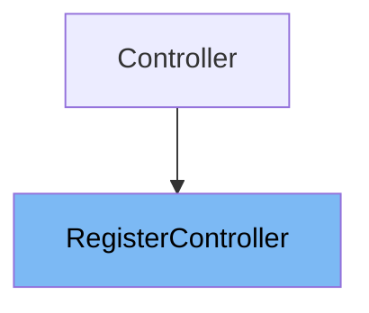

# Inheritance diagram

This diagram shows the inheritance tree of the class:



This document explains the <SwmToken path="app/Http/Controllers/Auth/RegisterController.php" pos="10:2:2" line-data="class RegisterController extends Controller">`RegisterController`</SwmToken> class in the application. We will cover:

1. What is <SwmToken path="app/Http/Controllers/Auth/RegisterController.php" pos="10:2:2" line-data="class RegisterController extends Controller">`RegisterController`</SwmToken>
2. Variables and functions in <SwmToken path="app/Http/Controllers/Auth/RegisterController.php" pos="10:2:2" line-data="class RegisterController extends Controller">`RegisterController`</SwmToken>

# What is <SwmToken path="app/Http/Controllers/Auth/RegisterController.php" pos="10:2:2" line-data="class RegisterController extends Controller">`RegisterController`</SwmToken>

<SwmToken path="app/Http/Controllers/Auth/RegisterController.php" pos="10:2:2" line-data="class RegisterController extends Controller">`RegisterController`</SwmToken> is a controller class located in <SwmPath>[app/…/Auth/RegisterController.php](app/Http/Controllers/Auth/RegisterController.php)</SwmPath>. It handles the registration process of new users, including validating the registration data and creating new user records. It leverages a trait to provide much of its functionality, minimizing the need for additional code.

<SwmSnippet path="/app/Http/Controllers/Auth/RegisterController.php" line="37">

---

The constructor function <SwmToken path="app/Http/Controllers/Auth/RegisterController.php" pos="37:5:5" line-data="    public function __construct()">`__construct`</SwmToken> initializes the controller instance. It applies the 'guest' middleware to ensure that only unauthenticated users can access the registration routes.

```hack
    public function __construct()
    {
        $this->middleware('guest');
    }
```

---

</SwmSnippet>

<SwmSnippet path="/app/Http/Controllers/Auth/RegisterController.php" line="48">

---

The function <SwmToken path="app/Http/Controllers/Auth/RegisterController.php" pos="48:5:5" line-data="    protected function validator(array $data)">`validator`</SwmToken> is responsible for validating incoming registration data. It uses Laravel's Validator facade to enforce rules such as requiring a name, a unique email, and a confirmed password with a minimum length.

```hack
    protected function validator(array $data)
    {
        return Validator::make($data, [
            'name' => 'required|string|max:255',
            'email' => 'required|string|email|max:255|unique:users',
            'password' => 'required|string|min:6|confirmed',
        ]);
    }
```

---

</SwmSnippet>

<SwmSnippet path="/app/Http/Controllers/Auth/RegisterController.php" line="63">

---

The function <SwmToken path="app/Http/Controllers/Auth/RegisterController.php" pos="63:5:5" line-data="    protected function create(array $data)">`create`</SwmToken> creates a new user instance after the registration data has been validated. It uses the User model to insert a new record into the database, hashing the password securely before saving.

```hack
    protected function create(array $data)
    {
        return User::create([
            'name' => $data['name'],
            'email' => $data['email'],
            'password' => bcrypt($data['password']),
        ]);
    }
```

---

</SwmSnippet>

<SwmSnippet path="/app/Http/Controllers/Auth/RegisterController.php" line="30">

---

The protected variable <SwmToken path="app/Http/Controllers/Auth/RegisterController.php" pos="30:3:4" line-data="    protected $redirectTo = &#39;/home&#39;;">`$redirectTo`</SwmToken> defines the URL path to which users are redirected after successful registration. In this case, it is set to '/home'.

```hack
    protected $redirectTo = '/home';
```

---

</SwmSnippet>

&nbsp;

*This is an auto-generated document by Swimm 🌊 and has not yet been verified by a human*

<SwmMeta version="3.0.0" repo-id="Z2l0aHViJTNBJTNBTGFyYXZlbC1PcGVuLVNvdXJjZS1Qcm9qZWN0cyUzQSUzQW11ZGFzaW4x" repo-name="Laravel-Open-Source-Projects"><sup>Powered by [Swimm](https://app.swimm.io/)</sup></SwmMeta>
