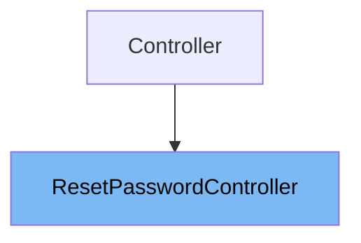

# Inheritance diagram

This diagram shows the inheritance tree of the class:



This document explains the <SwmToken path="app/Http/Controllers/Auth/ResetPasswordController.php" pos="8:2:2" line-data="class ResetPasswordController extends Controller">`ResetPasswordController`</SwmToken> class. It covers:

1. What <SwmToken path="app/Http/Controllers/Auth/ResetPasswordController.php" pos="8:2:2" line-data="class ResetPasswordController extends Controller">`ResetPasswordController`</SwmToken> is and its purpose
2. Variables and functions defined in <SwmToken path="app/Http/Controllers/Auth/ResetPasswordController.php" pos="8:2:2" line-data="class ResetPasswordController extends Controller">`ResetPasswordController`</SwmToken>
3. Details on the constructor and other members

# What is <SwmToken path="app/Http/Controllers/Auth/ResetPasswordController.php" pos="8:2:2" line-data="class ResetPasswordController extends Controller">`ResetPasswordController`</SwmToken>

<SwmToken path="app/Http/Controllers/Auth/ResetPasswordController.php" pos="8:2:2" line-data="class ResetPasswordController extends Controller">`ResetPasswordController`</SwmToken> is a controller class located in <SwmPath>[app/…/Auth/ResetPasswordController.php](app/Http/Controllers/Auth/ResetPasswordController.php)</SwmPath>. It is responsible for handling password reset requests in the application. The controller leverages a trait that provides the core functionality for password resets, allowing developers to override or extend its behavior if needed. It acts as the endpoint for password reset operations and manages redirection after a successful reset.

<SwmSnippet path="/app/Http/Controllers/Auth/ResetPasswordController.php" line="35">

---

The constructor function <SwmToken path="app/Http/Controllers/Auth/ResetPasswordController.php" pos="35:5:5" line-data="    public function __construct()">`__construct`</SwmToken> initializes the <SwmToken path="app/Http/Controllers/Auth/ResetPasswordController.php" pos="8:2:2" line-data="class ResetPasswordController extends Controller">`ResetPasswordController`</SwmToken> instance. It applies the 'guest' middleware to ensure that only unauthenticated users can access the password reset functionality.

```hack
    public function __construct()
    {
        $this->middleware('guest');
    }
```

---

</SwmSnippet>

<SwmSnippet path="/app/Http/Controllers/Auth/ResetPasswordController.php" line="24">

---

The protected variable <SwmToken path="app/Http/Controllers/Auth/ResetPasswordController.php" pos="28:3:4" line-data="    protected $redirectTo = &#39;/home&#39;;">`$redirectTo`</SwmToken> defines the URL path where users are redirected after successfully resetting their password. In this controller, it is set to '/home', meaning users will be redirected to the home page post-reset.

```hack
     * Where to redirect users after resetting their password.
     *
     * @var string
     */
    protected $redirectTo = '/home';
```

---

</SwmSnippet>

<SwmSnippet path="/app/Http/Controllers/Auth/ResetPasswordController.php" line="21">

---

The controller uses the <SwmToken path="app/Http/Controllers/Auth/ResetPasswordController.php" pos="21:3:3" line-data="    use ResetsPasswords;">`ResetsPasswords`</SwmToken> trait from the framework, which encapsulates the main logic for handling password reset requests, including validating tokens, resetting passwords, and sending responses. This trait allows the controller to remain concise while providing full password reset capabilities.

```hack
    use ResetsPasswords;
```

---

</SwmSnippet>

&nbsp;

*This is an auto-generated document by Swimm 🌊 and has not yet been verified by a human*

<SwmMeta version="3.0.0" repo-id="Z2l0aHViJTNBJTNBTGFyYXZlbC1PcGVuLVNvdXJjZS1Qcm9qZWN0cyUzQSUzQW11ZGFzaW4x" repo-name="Laravel-Open-Source-Projects"><sup>Powered by [Swimm](https://app.swimm.io/)</sup></SwmMeta>
